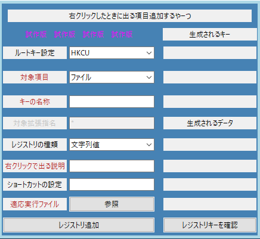
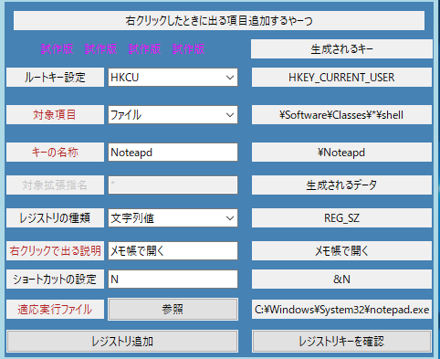
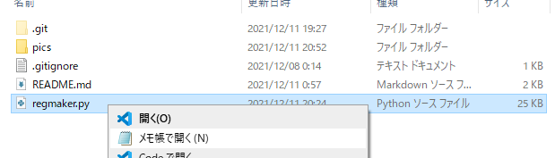
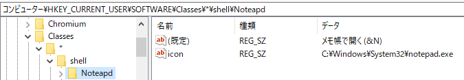
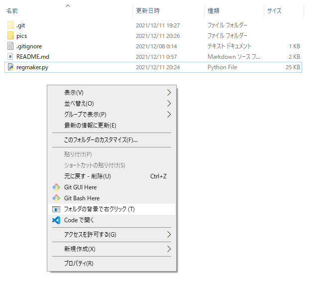
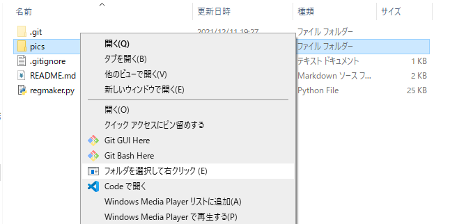
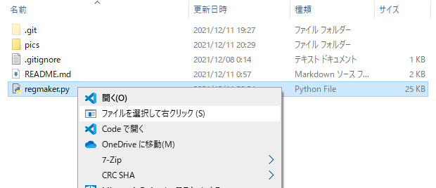
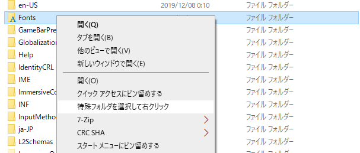
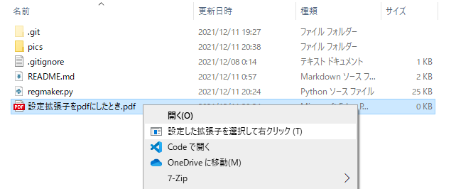

# RegistryMaker (仮)
Windows10(11) で ファイル 等を 右クリック したときの メニュー に 項目 を 追加 する用の簡易的レジストリ編集ソフト



## 以下の説明は開発途中のものであり、現在の仕様とは異なる可能性があります。
このプログラムで何か問題が発生した場合、作者は一切の責任を負いません。

## 推奨環境
 windows10(21H2), windows11(21H2)

## 動作方法

```regmaker.wpy```をダブルクリックで実行


## 使用例

### 入力例


### 出力例


### 登録例


※レジストリエディタによる表示

### 左行の説明

赤字が入力必須の内容

黒字はいじらなくてもいいけどいじるといい感じになるかもしれない内容

### 中行の説明

コンボボックス(選択肢から選ぶやつ)の初期値は推奨の項目に設定されてる

項目対象はどこで右クリックしたら表示されてほしいものなのかを設定する

拡張子設定は \.(ピリオド)を打つ必要はない (例:　　.pdfファイルなら　pdfと入力する)

### 右行の設定

最下の「レジストリキーを確認」ボタンを押すことで表示される

現在の入力状況に応じたレジストリキーおよびデータを返す

ここに記載されたPATHとデータがレジストリに追加される

ここを左クリックすると生成されるキーのPATHをC-cでコピーできるテキストボックスが表示される


### 「レジストリ追加」ボタン
ここを押すとレジストリが追加される


## 右クリックの場所(ソフトの対象項目コンボボックスに対応)

### フォルダ背景



### フォルダ


### ファイル


### 特殊フォルダ


### 特定拡張子



## TODO
READMEの清書

レジストリキーと値の削除機能

削除機能に伴い、追加したレジストリキー／値を覚えておく機能

文字列値,展開可能文字列値以外のレジストリ値の追加(正直何に使うのか分からない)
